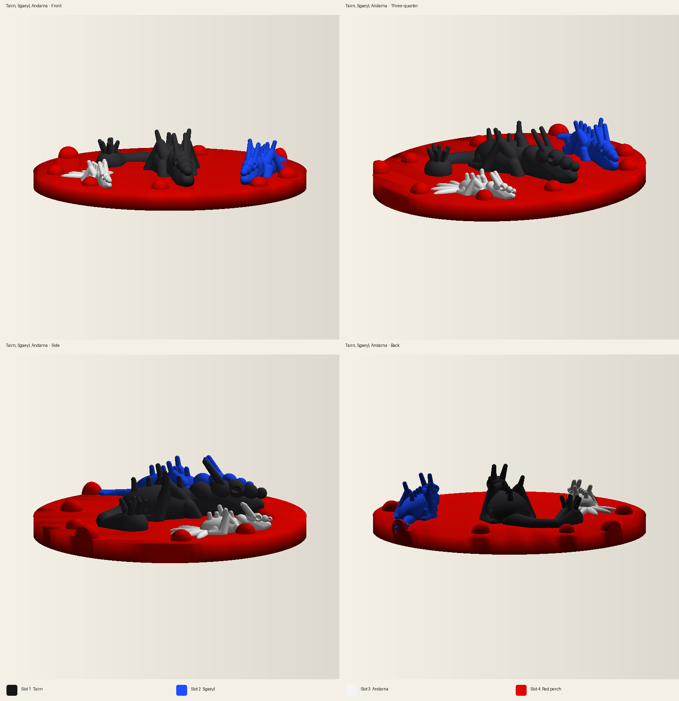

# AD5X print studio

Cloud workspace for modeling multi-color prints on a Flashforge AD5X. The printer is a 220 × 220 × 220 mm CoreXY with a 0.4 mm nozzle and a four-channel Intelligent Filament System. Prints in this repo are generated as manifold meshes, one closed shell per filament slot, and packed into a 3MF that Flash Studio or Orca-Flashforge can import.

The current print is Tairn, Sgaeyl, and Andarna on a shared red perch. All four channels are used: black, blue, white, and red.

| Slot | PLA color | Hex | What it prints |
| --- | --- | --- | --- | --- |
| 1 | Black | `#161616` | Tairn, the large dragon with the morningstar tail |
| 2 | Blue | `#1E4FFF` | Sgaeyl, the blue dragon with the dagger tail |
| 3 | White | `#F4F4F4` | Andarna, the small dragon with the feather tail |
| 4 | Red | `#E10600` | The perch |

Open `prints/fourth-wing-dragons/output/fourth-wing-dragons-ad5x.3mf` in Flash Studio. Slice notes and the regenerate command are in `prints/fourth-wing-dragons/README.md`.



Machine and filament defaults live in `studio/printer.json` and `studio/filaments.json`. Rebuild the dragons with:

```bash
pip install -r requirements.txt
python3 prints/fourth-wing-dragons/generate.py --quality final
```

Every channel in one job has to be the same material family. This studio uses PLA in all four slots. Map the sliced filaments onto whichever IFS channels are loaded, and leave the type set to PLA.

The Facts or Whacks prompt export is still in this repo: `facts-or-whacks-30-videos-prompts.txt` and `facts-or-whacks-30-videos.csv`.
