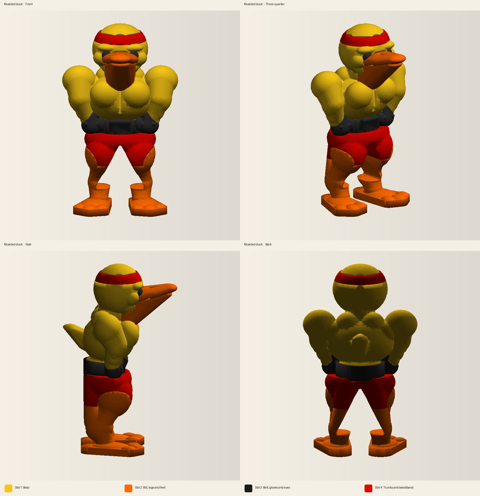

# AD5X print studio

Cloud workspace for modeling multi-color prints on a Flashforge AD5X. The printer is a 220 × 220 × 220 mm CoreXY with a 0.4 mm nozzle and a four-channel Intelligent Filament System. Prints in this repo are generated as manifold meshes, one closed shell per filament slot, and packed into a 3MF that Flash Studio or Orca-Flashforge can import.

The first print is a standing muscled duck that uses all four channels.

| Slot | PLA color | Hex | What it prints |
| --- | --- | --- | --- |
| 1 | Duck yellow | `#F5C518` | Body, head, arms, tail |
| 2 | Orange | `#FF6A00` | Bill, muscular legs, webbed feet |
| 3 | Black | `#1A1A1A` | Power belt, lifting gloves, eyes |
| 4 | Red | `#E10600` | Posing trunks, forehead sweatband |

Open `prints/muscled-duck/output/muscled-duck-ad5x.3mf` in Flash Studio. Slice notes, the slot map, and the regenerate command are in `prints/muscled-duck/README.md`.



Machine and filament defaults live in `studio/printer.json` and `studio/filaments.json`. Rebuild the duck with:

```bash
pip install -r requirements.txt
python3 prints/muscled-duck/generate.py --quality final
```

Every channel in one job has to be the same material family. This studio uses PLA in all four slots. Map the sliced filaments onto whichever IFS channels are loaded, and leave the type set to PLA.

The Facts or Whacks prompt export is still in this repo: `facts-or-whacks-30-videos-prompts.txt` and `facts-or-whacks-30-videos.csv`.
