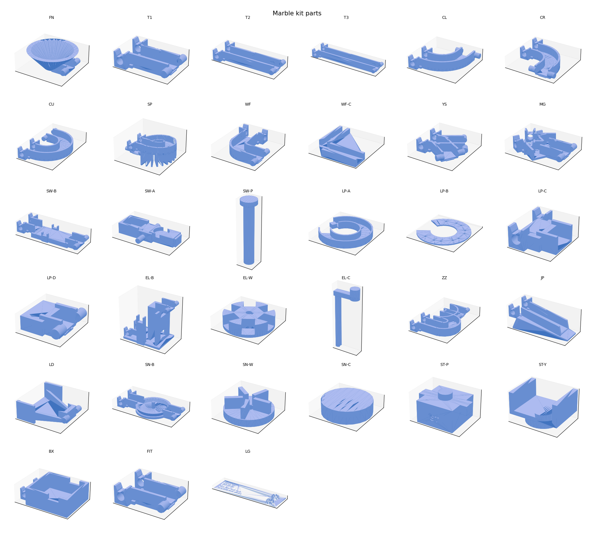
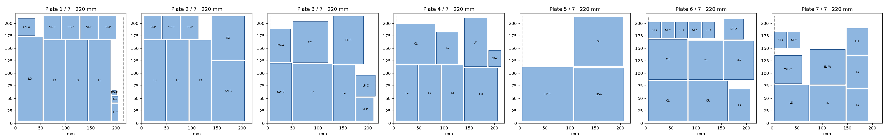

# Marble run kit

Twenty printable parts that snap together into a marble run. A starter set, with more long tubes than anything else, packs onto **7 plates** of 220 × 220 mm.

## Which ball to use

Use a **16 mm ball**.

| Ball | Use it? |
| --- | --- |
| 16 mm glass marble | Yes. This is the default. Buy a bag labeled 16 mm and check every ball with the gauge. |
| 5/8 in (15.875 mm) steel ball bearing | Yes. Same channels. Better for the loop, the jump, and the elevator, because a steel ball is heavier and rounder and keeps its speed. |
| Anything else | No. 1/2 in (12.7 mm) bearings rattle and jam. 25 mm toy marbles do not fit. |

You do not need special marble-run balls, screws, or glue. Glass and steel can share one run. Do not mix other diameters.

The legend card has two holes:

- **GO, 16.7 mm.** The ball must fall through.
- **NO-GO, 15.5 mm.** The ball must sit on top and not fall through.

A good 16 mm marble and a 5/8 in bearing both pass. A 14 mm marble falls through the NO-GO hole. Reject that one.

The channel is 19.6 mm wide, so a ball from about **15.6 mm to 16.6 mm** rolls without jamming. Cheap glass marbles are often out of round. Roll a few down a long tube before you print a whole plate.

## The 20 parts

Each part is marked on the side. `T3` over `x6` means “long tube, print six for the starter set.”

| Mark | Starter count | What it is |
| --- | --- | --- |
| `FN` | 1 | Funnel. Start of a run, or a target for the jump. Outlet only. |
| `T1` | 4 | Short tube, 52 mm between hinges. |
| `T2` | 4 | Medium tube, 100 mm. |
| `T3` | 6 | Long tube, 150 mm. This is the piece to print the most of. |
| `CL` | 2 | 90° curve, left. |
| `CR` | 2 | 90° curve, right. |
| `CU` | 1 | 180° U-turn. |
| `SP` | 1 | Spiral. Drops about 28 mm in a compact column. |
| `WF` | 1 | Waterfall, plus cover `WF-C`. Prints flat. Stand it up after the cover is on. |
| `YS` | 1 | Splitter, one in, two out. |
| `MG` | 1 | Merger, two in, one out. |
| `SW` | 1 | Seesaw. Pieces `SW-B` base, `SW-A` beam, `SW-P` pin. |
| `LP` | 1 | Loop. Pieces `LP-A` track, `LP-B` cover, `LP-C` entry, `LP-D` exit. |
| `EL` | 1 | Hand-crank elevator. Pieces `EL-B` base, `EL-W` wheel, `EL-C` crank. One direction. |
| `ZZ` | 1 | Zigzag brake. Slows a fast marble. |
| `JP` | 1 | Jump ramp. Open lip, no front connector. |
| `LD` | 1 | Wide landing for the jump. |
| `SN` | 1 | Spinner. Pieces `SN-B` base, `SN-W` wheel, `SN-C` cap. |
| `ST` | 8 | Support. `ST-P` post and `ST-Y` clip, eight of each. |
| `BX` | 1 | Finish box. Inlet only. |

`FIT` is a small hinge coupon, not one of the twenty. `LG` is the legend card and the ball gauge.



## How they connect

Tubes, curves, the spiral, the splitter, and the merger share one joint.

The upstream piece has two round stubs. The downstream piece has a keyhole on each side. Press the stubs down into the keyholes until they seat. The narrow neck is only there while you push the stub in. Once seated, the stub can rotate.

- Downhill angle is free from level to about **16°**. Past that the underside hits a stop.
- Do not fold a joint uphill. The stop is only on the downhill side.
- Every joint steps down by a fraction of a millimetre, so a mismatch is never a step up.
- The side walls break for a few millimetres at the joint so the stub can pass. A 16 mm ball bridges that gap.

Markings sit on the outer wall. The arrow points to the outlet.

## Printing

Files:

- `stl/*.stl` — one of each piece, already oriented for the bed.
- `plates/starter-220-*.stl` — the starter quantities on 220 × 220 mm plates.
- `images/plates.png` — what is on each plate.



Suggested slicer settings:

- 0.4 mm nozzle, 0.2 mm layers
- 3 perimeters
- 15% infill
- PLA or PETG
- No supports
- A brim on `ST-P`, `EL-W`, and `SP` if the corners lift

Print `FIT` first and snap two of them together (print a second copy, or snap the coupon’s own two ends to a `T1`). The stub should click in with firm finger pressure and then rotate. If it will not seat, open `scad/marble_kit.scad` and raise `fit_extra` by 0.1, then rerun `python3 scripts/build_kit.py`.

Every individual piece fits on a 180 × 180 mm bed. The combined plates are laid out for 220 × 220 mm, which is the common Ender-size bed. A 256 mm bed can use the same plates.

## Supports and slope

`ST-P` posts stack. The peg is 12 mm. Each post adds 20 mm of height. `ST-Y` clips over a tube and sits on the top peg.

Set long tubes around **8–14°**. Under about 6° some glass marbles stall, especially after a curve. At 10° a `T3` drops about 26 mm. At 14° it drops about 36 mm. Eight posts stacked are 160 mm, which is enough for a funnel at the top and a finish box near the table.

The track itself is the brace between posts. You do not need a free-standing tower under every joint. Prop the lower end of each sloped piece.

## A run that uses the set

1. `FN` on a tall stack.
2. Two `T3`s at about 12°.
3. `CL`, a `T2`, `CR`.
4. `SP` to lose a chunk of height in one footprint.
5. `YS` to split.
6. One branch: `ZZ` into `SW`, then onward.
7. The other branch: `JP` aimed at `LD`, then `LP` if you want the loop. Use a steel ball for the loop and the jump.
8. `MG` to join the branches.
9. `WF` stood upright, cover on, inlet at the top.
10. `EL` to lift the ball back up. Crank the wheel so pockets rise on the shroud side.
11. `CU` and `BX` to finish.

`SN` can sit anywhere a ball should pause and spin.

## The pieces that are not plain tubes

**Waterfall.** Printed flat. Snap `WF-C` over the open side (rails pointing down onto the walls). Stand it so the `UP` mark points up and the inlet hinge is at the top. The outlet hinge stays horizontal.

**Loop.** `LP-A` is the open track, printed flat. `LP-B` is the cover; the pegs on `LP-A` go through the holes in `LP-B`. Stand the pair up. Slide `LP-C` onto the entry tenon and `LP-D` onto the exit tenon. Feed the loop from a `T3` at 14–16°, or from the jump. A steel 5/8 in bearing makes the loop much more reliable than glass.

**Jump and landing.** `JP` is a fixed ramp with an open lip. `LD` is the wide mouth that catches it. Start with the landing about 80–100 mm in front of the lip and a little lower, then move it after a few throws. Steel balls fly straighter.

**Seesaw.** Drop `SW-P` through `SW-A` into the saddles on `SW-B`. Empty, the tail sits down and the cup waits under the inlet. One glass marble in the cup should tip it and roll out the lower chute. The tail has a pocket: leave it empty at first. If the beam will not tip back, put one marble in that pocket.

**Elevator.** One-way lift. `EL-W` is the wheel and prints flat. `EL-C` is the crank with a long shaft; the shaft prints standing up and has a flat that matches the wheel bore. Slide the wheel onto the shaft, then drop the shaft into the two saddles on `EL-B` so the wheel hangs between the towers and the pockets face the shroud. The crank stays outside one tower. Turn it so a pocket picks up a ball at the bottom window and carries it to the top window. Turning the other way dumps the ball back at the inlet.

**Spinner.** Drop `SN-W` onto the pin and press `SN-C` on top. A ball from the inlet hits a paddle, spins the wheel, and eventually finds the exit.

**Spiral.** The ribs under the helix are part of the print. They are not supports you remove. The inlet is the high hinge, the outlet is the low one.

## Changing the ball size

Open `scad/marble_kit.scad`. `marble_d` is 16. Channel width, funnel, gauge text, and the seesaw pocket all follow from the parts that read `marble_d`. The legend holes are fixed at 16.7 and 15.5; change those in `scad/parts_extra.scad` if you change the ball. Then:

```bash
python3 scripts/build_kit.py
```

That re-exports `stl/`, repacks `plates/`, and writes `validation.txt`. You need OpenSCAD 2021 or newer and Python 3 with NumPy and Matplotlib.

## If something does not roll

- Joint will not snap: raise `fit_extra` by 0.1 and rebuild. Do not sand the inside of the keyhole first.
- Marble stalls on a tube: steepen it. 8° is the bottom of the useful range for glass.
- Marble hops out of a curve: lower the angle, or come into the curve from `ZZ`.
- Seesaw stays tipped: add one marble to the tail pocket.
- Seesaw never tips: the tail pocket should be empty. A steel ball in the cup tips more easily than glass.
- Loop or jump is inconsistent: use a 5/8 in steel bearing for those tricks. Glass is fine everywhere else.
